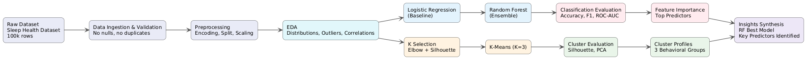
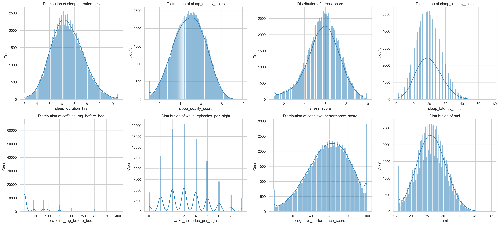
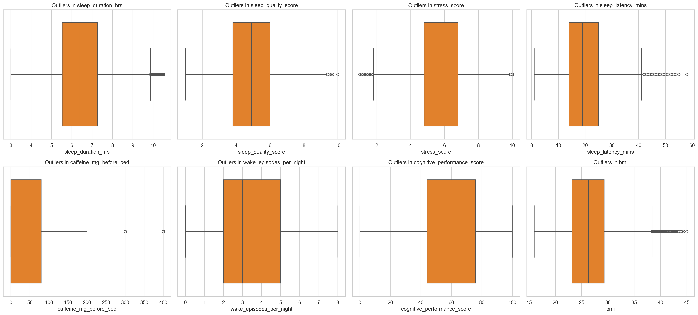
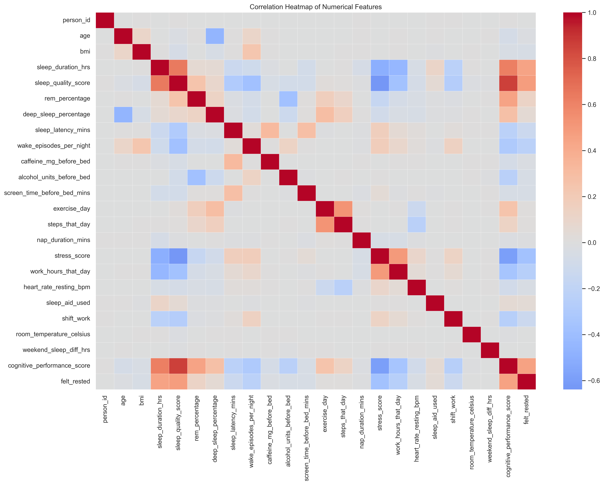
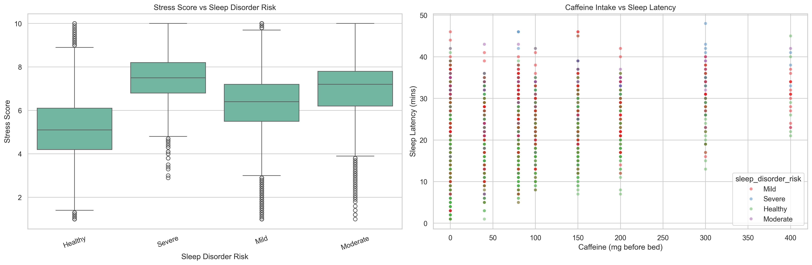
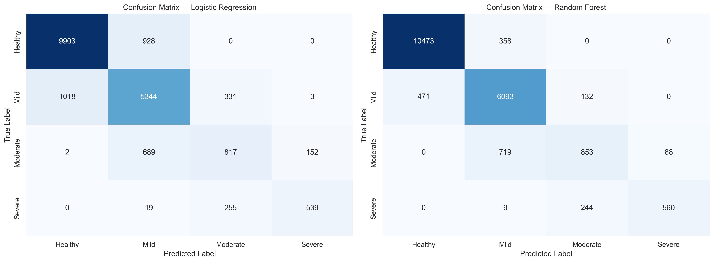
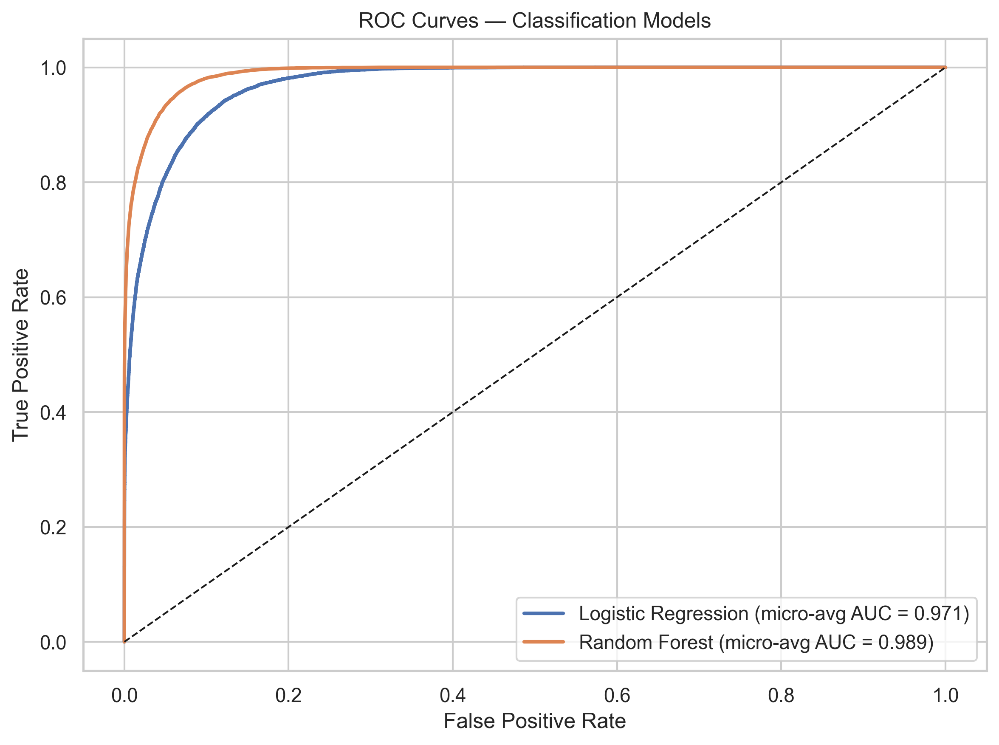
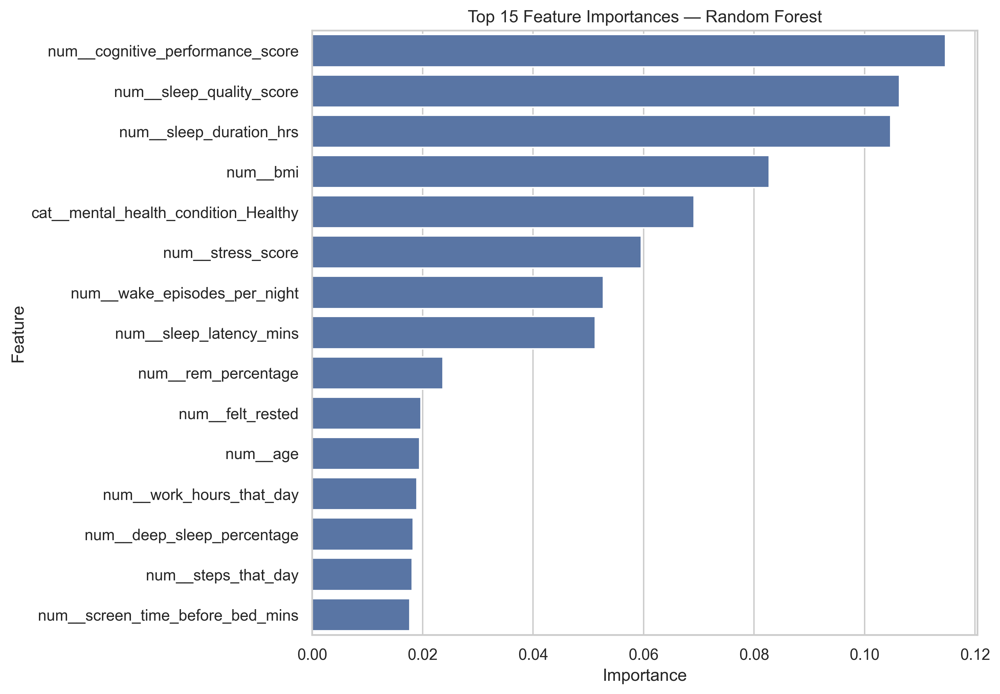
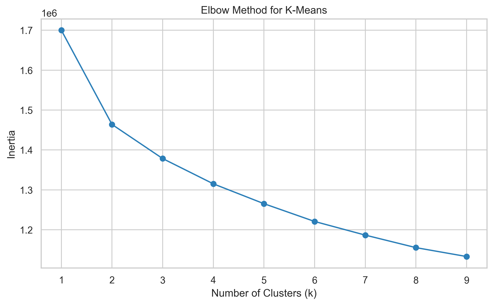
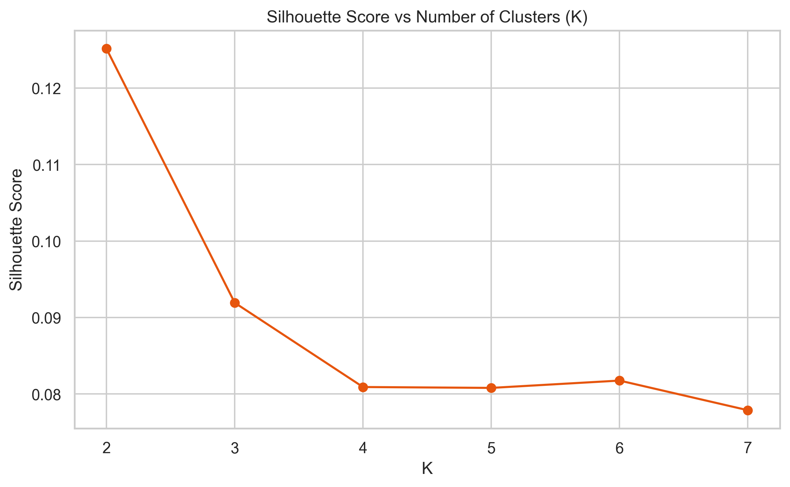

# Sleep Health Analysis and Prediction Using Machine Learning

Project repository: https://github.com/Ailya-Shah/CS-245-Semester-Project

**Report authors:** Ailya Zainab (523506) 

**Program:** Department of Computer Science, CS-245 Machine Learning  
**Repository owner / author note:** Ailya Shah, Data Science at SEECS

## Abstract

Sleep disorders are a growing public health concern due to their complex, multifactorial nature. This project applies machine learning to predict sleep disorder risk using a dataset of 100,000 individuals with behavioral, physiological, and lifestyle features. The problem is formulated as a four-class classification task (Healthy, Mild, Moderate, Severe), complemented by unsupervised clustering to identify behavioral patterns. Logistic Regression and Random Forest are compared, with Random Forest achieving superior performance over Logistic Regression. K-Means clustering reveals interpretable behavioral groups, and the results suggest that sleep quality, sleep duration, and cognitive performance are among the most influential predictors.

## Keywords

Sleep disorders, machine learning, random forest, classification, k-means clustering, health informatics

## Table of Contents

- [Introduction and Motivation](#introduction-and-motivation)
- [Related Work](#related-work)
- [Dataset](#dataset)
- [Methodology](#methodology)
- [Evaluation Metrics](#evaluation-metrics)
- [Results](#results)
- [Clustering Results](#clustering-results)
- [Discussion](#discussion)
- [Conclusion](#conclusion)
- [Project Files](#project-files)
- [Run the App](#run-the-app)
- [References](#references)

## Introduction and Motivation

Sleep is essential for cognitive function, immunity, emotional regulation, and metabolic health, yet sleep disorders affect a large portion of the global population and are often underdiagnosed due to costly and limited clinical methods. This project explores whether machine learning can enable early, scalable detection of sleep disorder risk using behavioral and physiological data.

The work is motivated by three goals: enabling early preventive intervention, identifying key predictors of sleep health, and uncovering hidden population-level sleep patterns through data-driven analysis. Unlike traditional binary-only approaches, this project models sleep disorder severity as a four-level classification task: Healthy, Mild, Moderate, and Severe risk.

## Related Work

Prior work has applied support vector machines, decision trees, neural networks, and ensemble methods to sleep-related prediction tasks. A recurring limitation in many studies is the use of small, clinically collected datasets or binary outcomes only. This project extends that direction by using a larger naturalistic dataset, a four-class target, and a direct comparison between a linear baseline and a nonlinear ensemble model.

The clustering component complements the supervised task by exploring whether sleep behavior naturally forms a small number of interpretable archetypes. The observed silhouette scores indicate overlap, supporting the view that sleep health exists on a spectrum rather than in sharply separated groups.

## Dataset

The dataset contains 100,000 records and includes demographic, physiological, lifestyle, and sleep-related variables. The target variable is `sleep_disorder_risk`, which has four classes: Healthy, Mild, Moderate, and Severe.

Key characteristics of the dataset:

- No missing values were observed.
- No duplicate rows were found.
- The target distribution is imbalanced, with the Healthy and Mild classes dominating.
- The feature set includes both numerical and categorical variables, making preprocessing essential.

### Descriptive Statistics

The figure below summarizes the project pipeline, from preprocessing to modeling and evaluation.



The EDA figures below show the most important descriptive patterns in the data.









## Methodology

The analytical pipeline follows a five-stage architecture: data ingestion and validation, preprocessing, exploratory data analysis, supervised classification, and unsupervised clustering. The classification and clustering tracks are kept separate so the target label does not influence cluster discovery.

### Preprocessing

All transformations are implemented inside scikit-learn pipeline objects to prevent data leakage. The preprocessing steps include:

- Identifier removal.
- Target encoding using LabelEncoder.
- 80/20 stratified train-test split.
- Numerical features: mean imputation followed by standardization.
- Categorical features: most-frequent imputation followed by one-hot encoding with handle_unknown='ignore'.

### Supervised Classification Models

Two models were trained on the same split with the same preprocessing:

- Logistic Regression: linear baseline with solver='lbfgs', max_iter=1000, and random_state=42.
- Random Forest: ensemble model with 300 trees, n_jobs=-1, and random_state=42.

### Unsupervised Clustering

K-Means clustering was applied to numerical sleep-behavior features after standardization. K was selected using both the elbow method and silhouette analysis.

## Evaluation Metrics

The project reports the following metrics:

- Accuracy: overall fraction of correct predictions.
- Weighted Precision, Recall, and F1: class-balanced by support.
- Macro F1: equal weight per class.
- ROC-AUC (OvR, weighted): discrimination ability across all classes.
- Silhouette score: cohesion and separation for clustering.

## Results

Random Forest outperformed Logistic Regression across the main classification metrics. The result is consistent with the report’s conclusion that nonlinear interactions in the health variables are better captured by an ensemble model.

### Confusion Matrices



### ROC Curves



### Feature Importance



## Clustering Results

K-Means produced three interpretable behavioral profiles, but the silhouette scores show that the structure is weakly separated. This supports using clustering for exploratory profiling rather than strict assignment.

### Elbow Method for selecting k



### Silhouette Comparison



### PCA Cluster View


## Discussion

The main findings are:

- Sleep disorder risk is predictable from naturalistic behavioral and physiological data.
- Random Forest is the best-performing model in this project.
- Cognitive performance, sleep quality, and sleep duration are among the strongest predictors.
- The clustering structure is overlapping, indicating that sleep health is better represented as a spectrum than as a set of sharply separated groups.

## Conclusion

This project presents a complete workflow for sleep disorder risk prediction and behavioral profiling. The notebook contains the full analysis, and the Streamlit application provides a quick binary sleep quality estimate for demonstration purposes.

## Project Files

- `sleep_health_analysis.ipynb`: notebook for data analysis, modeling, evaluation, and clustering.
- `app.py`: Streamlit app for a quick Good/Bad sleep quality estimate.
- `sleep_health_dataset.csv`: dataset used in the project.
- `requirements.txt`: Python dependencies for the app.
- `visualizations/eda/`: EDA figures used in the report.
- `visualizations/evaluation/`: classification evaluation figures.
- `visualizations/clustering/`: clustering figures.

## Run the App

Install dependencies and start the Streamlit app:

```bash
pip install -r requirements.txt
streamlit run app.py
```

## References

1. L. Breiman, “Random forests,” Machine Learning, vol. 45, no. 1, pp. 5–32, 2001.
2. E. R. DeLong, D. M. DeLong, and D. L. Clarke-Pearson, “Comparing the areas under two or more correlated receiver operating characteristic curves: A nonparametric approach,” Biometrics, vol. 44, no. 3, pp. 837–845, 1988.
3. Q. McNemar, “Note on the sampling error of the difference between correlated proportions or percentages,” Psychometrika, vol. 12, no. 2, pp. 153–157, 1947.
4. F. Pedregosa et al., “Scikit-learn: Machine learning in Python,” Journal of Machine Learning Research, vol. 12, pp. 2825–2830, 2011.
5. M. Thalla, “Sleep Health and Daily Performance Dataset,” Kaggle, 2023.
